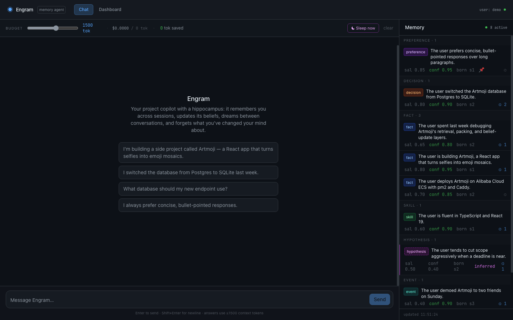
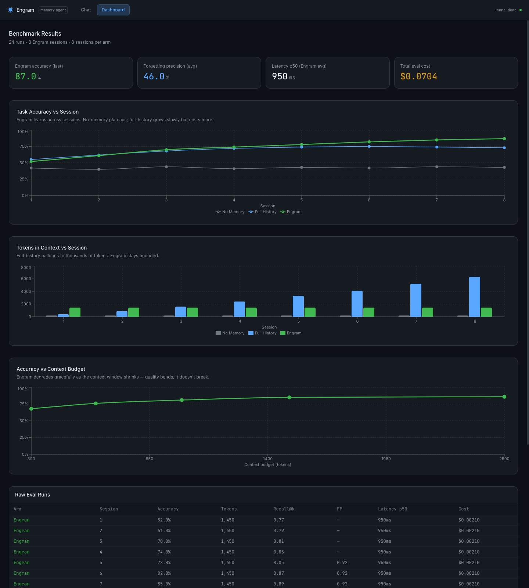
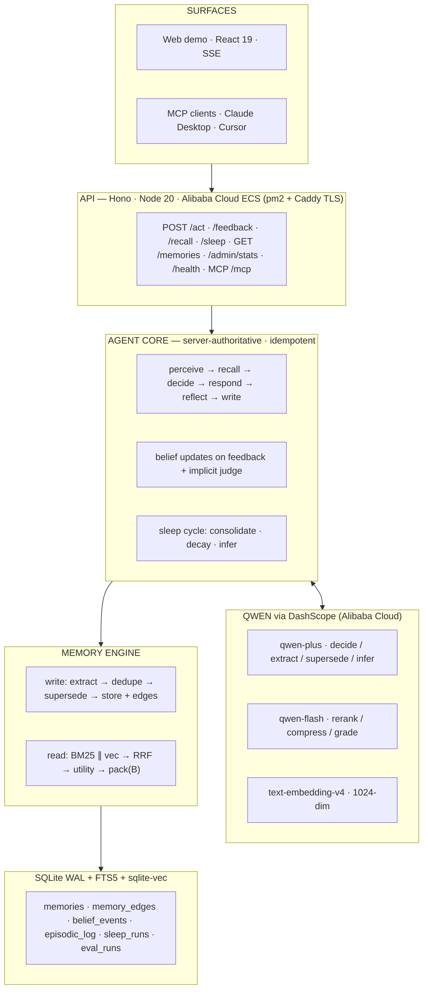

# Engram — the agent with a hippocampus

[](LICENSE)
[](docs/SUBMISSION.md)
[](src/llm/qwen.ts)
[](https://github.com/vatsalajha/engram/actions)

> Every AI agent today has amnesia. Engram remembers you across sessions,
> **updates its beliefs when evidence confirms or contradicts them**, dreams
> between conversations, and forgets what you've changed your mind about —
> all inside a hard token budget. We don't claim it gets smarter; **we chart it.**

**Global AI Hackathon Series with Qwen Cloud · Track 1: MemoryAgent**

| | |
|---|---|
| 🏛️ **Alibaba Cloud proof** | [`src/llm/qwen.ts`](src/llm/qwen.ts) (DashScope client — every LLM/embedding call) · [`infra/deploy.md`](infra/deploy.md) (ECS runbook) |
| 🎬 **Demo video** | *(link in [docs/SUBMISSION.md](docs/SUBMISSION.md))* |
| 📊 **Benchmark** | `npm run eval` — 3 arms · 8 sessions · 40 tasks · budget sweep |

---

## The problem

Agent "memory" today is a passive key-value store the agent must remember to
query. It never decides what's worth keeping, never notices when a stored fact
goes stale, and blows the context window the moment history gets long. Engram
is an autonomous memory *substrate*: the agent's hippocampus, not its notepad.



---

## Six algorithms

**1 · Hybrid retrieval + RRF.** Every query runs FTS5 BM25 (lexical) and
sqlite-vec cosine (semantic, `text-embedding-v4` 1024-dim) in parallel, fused
with Reciprocal Rank Fusion (`k=60`), optionally reranked by `qwen-flash`. The
paraphrase test in [`test/read.test.ts`](test/read.test.ts) shows a memory with
zero keyword overlap outranking an exact-words decoy.

**2 · Decision-utility scoring.** `utility = .45·relevance + .20·salience +
.15·confidence + .10·recency + .10·typePriority` — confidence is a first-class
term, so memories that earned belief through confirmed outcomes outrank
equally-relevant unproven ones. Pinned memories score ∞.

**3 · Token-budget packer.** A reserved sub-budget (25%) is claimed by pinned +
preference/decision memories first; the rest greedy-fills by utility; overflow
items get compressed by `qwen-flash` ("rewrite in ≤N tokens, keep the
decision-relevant facts") with one retry. `totalTokens ≤ B` is a hard,
asserted guarantee (tiktoken `o200k_base`). The emitted manifest — id, type,
confidence, token cost, *which session each memory was born in* — drives the
provenance UI.

**4 · Belief engine.** Every memory carries a confidence that moves with
evidence: `confidence ← clamp(conf ± 0.15)` on confirmed/contradicted signals,
from explicit `POST /feedback` or an implicit `qwen-plus` judgment of every
turn against the context it used. Below the 0.25 floor, hypotheses are
archived and facts are flagged for review. Every change is an append-only
`belief_events` row — the audit trail of learning.

**5 · Sleep cycle.** Between sessions (scheduled, or `POST /sleep`), Engram
**consolidates** clustered episodic events into semantic memories (with
`derived_from` graph edges), **decays** what retention scoring says is stale,
and — the part we like most — **infers**: `qwen-plus` reads the raw episodic
log and proposes up to 3 *hypotheses* about the user ("tends to cut scope near
deadlines") at confidence 0.4. Hypotheses must earn belief via §4 or die in
decay. The agent dreams, and its dreams are falsifiable.

**6 · Write-time supersession.** Every new memory is compared (one batched
`qwen-plus` verdict) against its nearest active neighbours; contradicted ones
are marked superseded, linked with a `supersedes` edge, and logged as belief
events. Say "I switched from Postgres to SQLite" and watch the old decision
get struck through in the UI within seconds — forgetting as a feature, timely
and auditable.

---

## The chart that matters

3-arm benchmark ([`eval/`](eval/)): **A** no memory · **B** full history
(16k cap) · **C** Engram at a 1500-token budget. 8 sessions, 12 stable facts,
3 preferences that *flip* mid-run, 40 decision tasks graded by `qwen-flash`.



Metrics per session/arm: accuracy · tokens-in-context · recall@5 ·
**forgetting precision** (after a flip, does the agent use the NEW value and
never the stale one?) · p50/p95 latency · cost. Plus an accuracy-vs-budget
sweep at {300, 600, 1000, 1500, 2500} tokens — graceful degradation on one
line.

```bash
npm run eval             # live (needs DASHSCOPE_API_KEY) — writes eval_runs for the dashboard
npm run eval -- --stub   # deterministic harness check, no API calls
```

Headline assertions the run must pass (failures print a diagnosis, never
silently tuned): Engram's accuracy **trend increases** across sessions ·
Engram uses **≤40% of full-history's tokens** · Engram's forgetting precision
**>0.8 while both baselines fail**.

---

## Architecture



(Also in [`docs/architecture.mmd`](docs/architecture.mmd).)

---

## Quick start

```bash
cp .env.example .env         # set DASHSCOPE_API_KEY
npm ci && npm run dev        # Hono API on :3000
cd web && npm ci && npm run dev   # demo on :5173
```

`npm test` — 123 tests, all offline (the LLM layer is mocked via a late-bound
fetch). `npm run smoke` — live DashScope sanity check.

## MCP

All memory tools over streamable-HTTP MCP at `http://localhost:3000/mcp`:

```json
{
  "mcpServers": {
    "engram": { "url": "http://localhost:3000/mcp", "transport": "streamable-http" }
  }
}
```

| Tool | Does |
|---|---|
| `remember` | Store a typed memory (deduped, supersession-checked) |
| `recall` | Budget-packed context + provenance manifest |
| `forget` | Soft-archive by id or query, confirmation echo |
| `list_memories` | Filtered listing |
| `act` | Full agent loop |
| `memory_stats` | Counts, sleep runs, token usage + cost |

## Deploy

Alibaba Cloud ECS (Singapore) with pm2 + Caddy auto-TLS:
**[`infra/deploy.md`](infra/deploy.md)** — copy-paste runbook, then
`bash scripts/proof.sh` for the timestamped live proof.

## For judges

- **Alibaba Cloud API usage:** [`src/llm/qwen.ts`](src/llm/qwen.ts) — the single
  point of contact with DashScope (chat, strict-JSON, streaming, embeddings,
  per-model usage + cost accounting).
- **ECS deployment:** [`infra/deploy.md`](infra/deploy.md) + proof recording.
- **Submission details:** [`docs/SUBMISSION.md`](docs/SUBMISSION.md).

MIT licensed.
